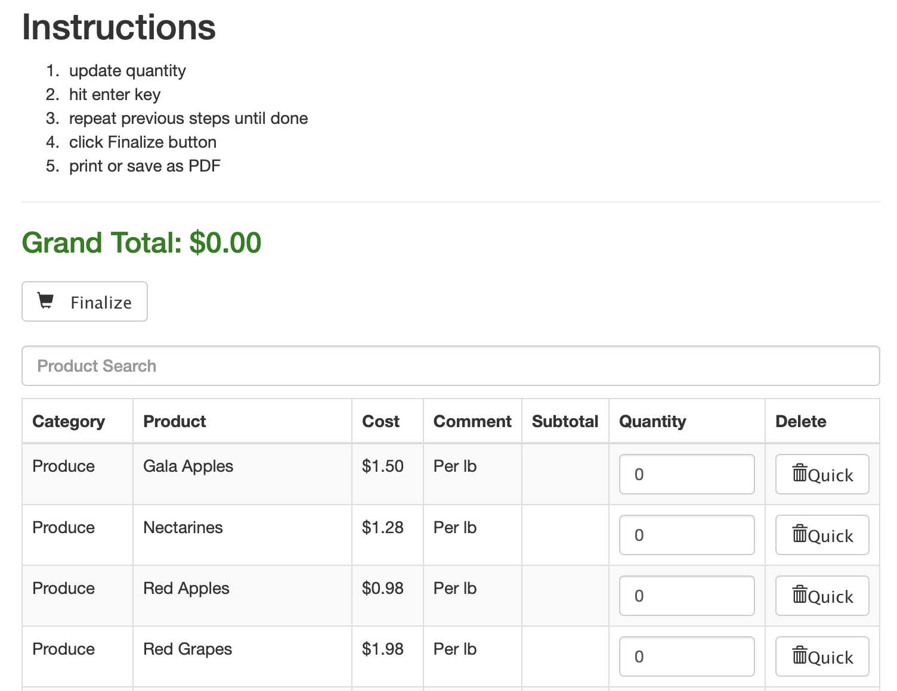

# shopper
Attention all shoppers: build your grocery list! I built this application to help with our grocery budget. My goal was to build a simple interface that resembles a spreadsheet. 

# How to Run

## Run the Web UI
1. Open a terminal window
1. Type this command: `npm run start`
1. Press enter
1. Goto web browser: http://localhost:8080
1. Interact with the list similar to a spreadsheet: (1) update quantity, (2) hit enter, (3) repeat
1. When the list is completed, click the Finalize button to remove items with 0 quantity
1. Use the browser to print your list
    * Pro Tip: save as PDF and send to your mobile device
1. To stop the program type Ctrl+C on the keyboard

## Prepare your list
1. Open the [products.csv](./products.csv) file
1. This is the file you will want to modify so that it contains products that you typically by
    * Pro Tip: use your recent grocery receipts to populate this list!
1. nodemon is running, so the web application will restart as changes are detected
1. Refresh your browser to see the changes    

# Versions
0.0.1 - very very beta
